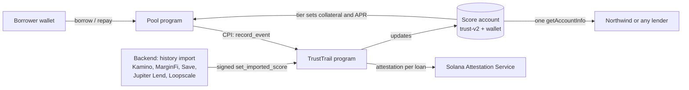

# TrustTrail

**Collateral gets you the loan. TrustTrail gets you the price.**

TrustTrail is an on-chain repayment record for Solana wallets, plus a USDC lending pool that prices each loan from it. Repay on time and you post less collateral and pay a lower rate. Any other lender can read the same record straight from Solana.

[Live app](https://trusttrail-ten.vercel.app) · · [TrustTrail program](https://explorer.solana.com/address/BtgvVKaXQMJsRUdZ8ahuBftnwDpYtass15TqTwsJJA9s?cluster=devnet) · [Pool program](https://explorer.solana.com/address/Eg1s6qF3UhrUYuccyKy9pMBqDQd4beQjYYYZdGs4EkWL?cluster=devnet)

Everything runs on Solana devnet. tUSDC is the app's own test token, not real USDC.

## Try it in two minutes

1. Set Phantom or Solflare to **devnet** and get devnet SOL at [faucet.solana.com](https://faucet.solana.com).
2. Open the [live app](https://trusttrail-ten.vercel.app) and connect. No sign-up.
3. On **Borrow**, press "Get 1,000 tUSDC" (once every 24 hours), then borrow against SOL or tUSDC.
4. Repay. The repayment is written to your record in the same transaction; the **Record** page shows it.
5. Open **/partner** and paste any wallet: Northwind, a separate demo lender, prices it from the same on-chain account.
6. On **Pool**, deposit tUSDC as a lender and watch your share of the interest.

## The problem

DeFi lenders treat every wallet as a stranger. A wallet that has repaid on time for a year posts the same collateral and pays the same rate as one created yesterday. The history is public on Solana already; nobody turns it into a price.

## How it works



1. **Record.** When a loan is repaid or liquidated, the pool calls TrustTrail in the same transaction. TrustTrail writes a Solana Attestation Service attestation for the loan and updates the wallet's score account. Only whitelisted writers (the pool's PDA, other lenders) can record.
2. **Score.** The program keeps a 0–1000 score and a tier. A wallet can also import its past history from five lending protocols; the backend reads it through Helius, scores it, and signs it.
3. **Price.** The pool reads the score account at borrow time. Every loan stays fully collateralized; the tier sets how much collateral and what APR.

| Tier | Needs | Collateral | APR at the 2% base rate | Max loan |
| --- | --- | --- | --- | --- |
| Unproven | no record | 150% | 6.0% | 100 USDC |
| Bronze | score above 0 | 140% | 4.0% | 250 USDC |
| Silver | score ≥ 500, 3+ on-time loans | 130% | 2.0% | 1,000 USDC |
| Gold | score ≥ 750, 8+ on-time loans | 120% | 0.5% | 5,000 USDC |

### What counts toward the score

The rules come from our own Dune analysis of Solana lending, done before any code was written.

- A loan under $100, or open less than 24 hours, carries no weight. This stops wash loans from farming a score.
- Weight grows with the log of the principal, so one huge loan does not outweigh a steady history.
- Loans with a due date count twice as much as floating-rate DeFi loans, which show position management rather than on-time repayment.
- Penalties for late payments and liquidations halve every 90 days. A liquidation blocks Silver and Gold for 90 days.

## Risk design

The pool lends real value against collateral, so lender safety comes first.

- **Fully collateralized, priced by Pyth.** Collateral is valued with Pyth prices no older than 60 seconds. SOL loans are liquidated below 110% (5% bonus to the liquidator), tUSDC loans below 105% (2% bonus).
- **Due dates and grace.** Every loan is due 30 days after it opens. After 3 more days it is in default and anyone can liquidate it.
- **Variable rate.** The base rate rises with utilization: 2% when idle, 5.5% at 95%, up to 36% when fully lent. Each tier adds its spread on top (+4%, +2%, 0, −1.5%).
- **90% borrow cap.** New loans stop once 90% of the pool is lent, so 10% always stays free for withdrawals.
- **First-loss reserve.** The protocol keeps 10% of borrower interest. Bad debt from a liquidation is taken from that reserve before it touches lenders.
- **Honest liquidity.** Withdrawals come only from idle cash; the Pool page shows how much could leave right now and when the rest returns.

## Architecture

| Part | Where | What it does |
| --- | --- | --- |
| `programs/trusttrail` | Anchor program `BtgvVKaX…JA9s` | Score accounts, SAS attestations, writer whitelist, imported scores |
| `programs/pool` | Anchor program `Eg1s6qF3…EkWL` | USDC vault, LP shares, borrow, repay, liquidate, interest accrual |
| `backend` | TypeScript + Express on Render | Prepares unsigned transactions, history import, tUSDC faucet |
| `app` | React + Vite on Vercel | Borrow, Record, Pool and Import pages; Northwind at `/partner` |

Northwind reads the score account in the browser with one `getAccountInfo` call and decodes it itself (`app/src/partner.ts`), without TrustTrail's backend. That is the point: the record is portable.

Tests: 35 unit and 33 LiteSVM integration tests for the pool program, 134 backend tests.

## Built during the hackathon

TrustTrail v1 (Aug 17 – Sep 10, 2026, before the hackathon) was one Anchor program holding a Helius-based score from Kamino history, a `/score` API, a score page, a Reclaim verify flow and CI.

During the hackathon (Sep 25 onward) we built: SAS attestations, scoring v2 with weighted loans and tiers, the writer whitelist, history import from MarginFi, Save, Jupiter Lend and Loopscale, the USDC lending pool program, and a new app with the Borrow, Pool, Import and Northwind pages. Commit dates show the split.

## Limitations

The main ones; the full list, with the reason for each, is in the [Decisions Log]([decisions log link]).

- **Devnet only.** The pool lends tUSDC, a test token.
- **Imported history is trusted through our backend's signature.** Prices for imported loans come from off-chain sources. The plan is to verify on-chain, or drop the import once native records are enough.
- **Loans in a token with no price source are left out of an imported score**, including their liquidations.
- **Some imported prices come from Binance in USDT**, assuming 1 USDT = $1.
- **The backend runs on a free Render instance.** After 15 minutes idle, the first request can take about a minute.

## Running locally

```bash
# Programs
anchor build
cargo test                         # pool unit + LiteSVM integration tests

# Backend (backend/.env: SOLANA_RPC_URL, HELIUS_API, DATABASE_URL, TUSDC_MINT,
# WRITER_PRIVATE_KEY, FAUCET_PRIVATE_KEY, ALLOWED_ORIGINS, plus price keys)
cd backend && npm install
npx tsx --test "src/**/*.test.ts"
npx tsx src/server.ts

# App (app/.env: VITE_BACKEND_URL, VITE_RPC_URL)
cd app && npm install && npm run dev
```

## Stack

Solana · Anchor (Rust) · Solana Attestation Service · Pyth · SPL Token · LiteSVM · TypeScript · Express · Postgres · React · Vite · Solana wallet-adapter · Helius · Dune · Render · Vercel · GitHub Actions